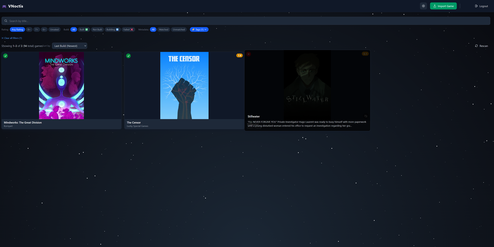
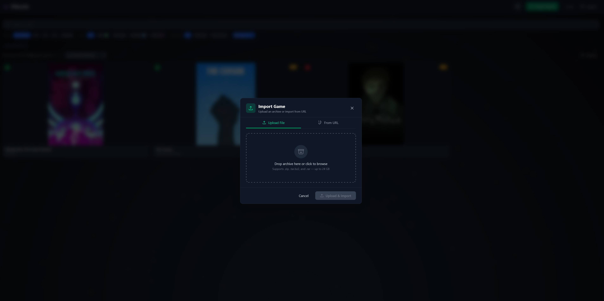
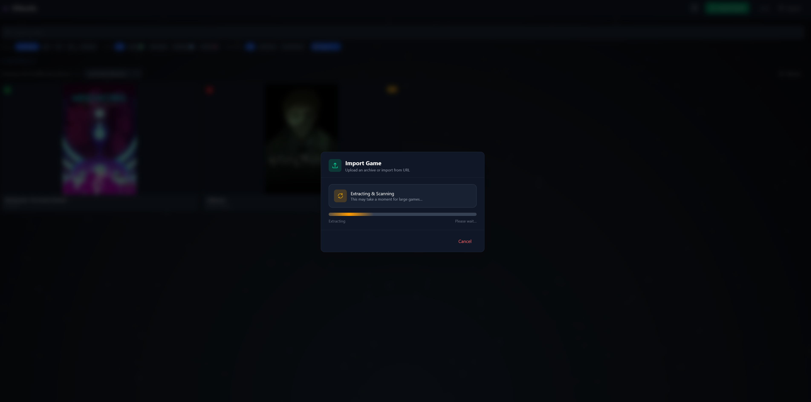
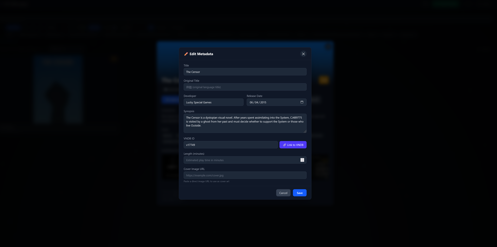
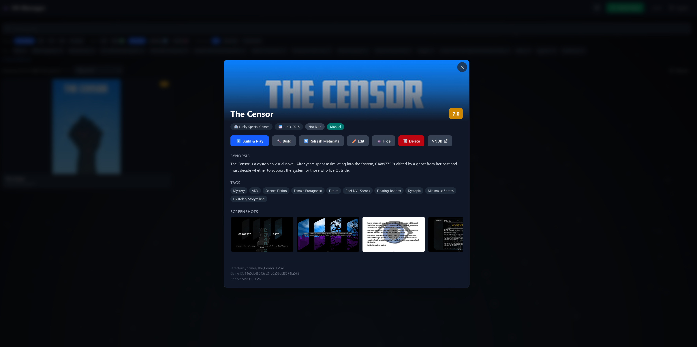
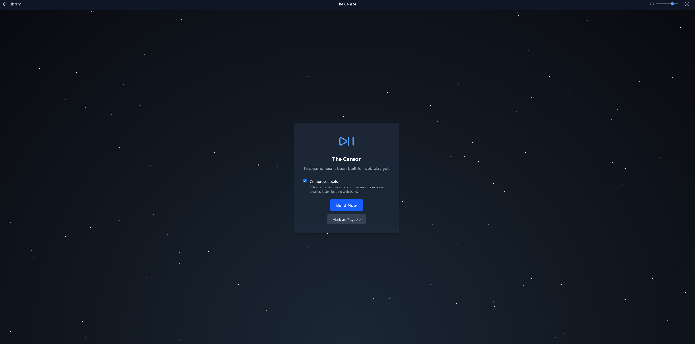
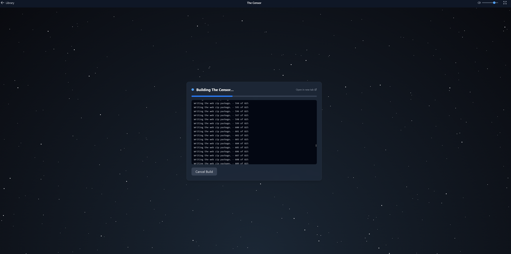

<div align="center">

# 🎴 VNoctis Manager

**Self-hosted visual novel library manager & web player**

[](https://docs.docker.com/compose/)
[](https://nodejs.org/)
[](https://react.dev/)
[](https://www.python.org/)
[](LICENSE)

</div>

---

## 📖 Overview

**VNoctis Manager** is a self-hosted, Docker-based web application for managing, building, and playing [Ren'Py](https://www.renpy.org/) visual novels directly in your browser. Point it at a directory of Ren'Py games and get a **Netflix-style browsable library** enriched with metadata from [VNDB](https://vndb.org/), one-click WebAssembly builds, and an in-browser player — all behind a single `docker compose up`.

---

## 📸 Screenshots

| | |
|:---:|:---:|
|  |  |
| **Gallery View** — Browse your library in a responsive card grid | **Import Game** — Upload an archive or paste a URL |
|  |  |
| **Extracting Game** — Real-time progress during extraction | **Edit Metadata** — Manually edit or refresh from VNDB / Steam |
|  |  |
| **View Game Details** — Cover art, synopsis, tags, screenshots | **Building Game** — Live log streaming during WebAssembly build |
|  |  |
| **Build Queue** — Progress and queue status | **Loading Game** — In-browser player loading a compiled VN |
---

## ✨ Features

- **Game Library** — Responsive card grid with banner-style cover images, skeleton loading states, and automatic discovery of new games via file watcher
- **Search & Filter** — Client-side search by title, filter by rating / build status / metadata source / tags, sort by title / rating / release date / date added / last built
- **Pagination** — Page-based navigation with prev/next controls, ellipsis compression for large libraries, "Show All" toggle, and responsive sibling-window that tightens on mobile
- **Hide / Unhide Games** — Hide games from the library view via a hover icon on cards or a button in the detail modal; hidden count shown as a pill badge in the sort bar with one-click toggle to reveal hidden items; "Unhide All" button to restore all hidden games at once
- **VNDB Integration** — Fuzzy-matches game directories to VNDB entries and fetches cover art, synopsis, ratings, developer, tags, screenshots, release date, and estimated play time
- **Steam Integration** — Search the Steam catalog by name (games + DLC), link any game to a Steam app ID, and pull cover art (library capsule), description, developer, release date, genres, screenshots, and Metacritic score; locally-cached app list refreshes every 24 hours
- **Web Build System** — One-click Ren'Py → WebAssembly compilation with real-time SSE log streaming, build queue management, and cancel/retry support; build logs open in a dedicated full-screen viewer with line numbers, color-coded output, filtering, auto-scroll, and copy-to-clipboard
- **Image Compression** — Automatic lossy recompression of JPEG, PNG, and WebP images during web builds using a symlink overlay — original game files are never modified, web builds are 30–60% smaller
- **Pre-built ZIP Import** — Drop a pre-built web distribution `.zip` into a game directory and the scanner auto-detects, extracts, and marks it as built — no rebuild needed; a **"Mark as Playable"** fallback button lets you bypass the build system entirely for manually extracted web builds
- **Game Import via UI** — Upload a `.zip`, `.tar.bz2`, or `.rar` game archive or paste a remote URL — with real-time progress bars, drag-and-drop, and automatic extraction into the games directory
- **In-Browser Player** — Full-screen iframe player with chrome bar, orientation hints for mobile, and a save warning toast
- **Metadata Management** — Edit metadata manually, refresh from VNDB or Steam, force-link or unlink VNDB / Steam IDs via tabbed search with autocomplete, custom covers via URL
- **Dark / Light Theme** — System-aware theme toggle with manual override, animated star-field background on build screens and library (dark mode), fully responsive from mobile to desktop
- **Authentication** — Single-user login with environment-configurable credentials, persistent JWT sessions that survive browser restarts, automatic session validation, and login rate limiting
- **Progressive Downloads** — Automatically generates `progressive_download.txt` rules so GUI images load upfront while game art, music, and voice stream on demand — existing rules in a game directory are preserved
- **Custom Loading Screen** — Branded web presplash image automatically replaces the default Ren'Py loading screen in all web builds
- **Docker-Native** — Single compose stack with health checks, resource limits, network isolation, and named volumes

---

## 🏗️ Architecture

The stack consists of three Docker services communicating over an internal bridge network:

```
┌─────────────┐     ┌──────────────┐     ┌──────────────┐
│   vnm-ui    │────▶│   vnm-api    │────▶│ vnm-builder  │
│  (nginx)    │     │  (fastify)   │     │  (fastapi)   │
│  port 80    │     │  port 3001   │     │  port 3002   │
└─────────────┘     └──────────────┘     └──────────────┘
       │                   │                    │
       ▼                   ▼                    ▼
  /web-builds (ro)    /data (SQLite)       /web-builds
  /covers (ro)        /covers              /games (ro)
  /screenshots (ro)   /screenshots         /renpy-sdk (ro)
                      /games (ro)
                      /web-builds (ro)
```

| Service | Stack | Role |
|---|---|---|
| **vnm-ui** | React 19 · Vite 6 · Tailwind CSS v4 · Nginx | SPA frontend — library page, game detail modals, search/filter/sort, in-browser player |
| **vnm-api** | Node.js 24 · Fastify 5 · Prisma · SQLite | REST API — game scanning, VNDB & Steam metadata enrichment, cover & screenshot caching, build orchestration, SSE log streaming |
| **vnm-builder** | Python 3.11 · FastAPI | Build service — Ren'Py SDK `web_build` compilation to WebAssembly, build queue with concurrency control |

---

## 🚀 Quick Start

### Prerequisites

- **Docker Engine 24+** and **Docker Compose v2**
- **Ren'Py game directories** — each game must contain a `game/` subdirectory with `.rpy`/`.rpyc` files, or a `renpy/` directory at the game root

> **Note:** The **Ren'Py SDK** and **web platform** are **automatically downloaded** on first container start. No manual SDK installation is required. The SDK files are stored in the `RENPY_SDK_PATH` volume so they persist across restarts. You can change the SDK version via the `RENPY_SDK_VERSION` environment variable (default: `8.5.2`).

### Using pre-built images (recommended)

```bash
# 1. Clone the repository
git clone <repo-url> && cd vn-manager

# 2. Configure environment
cp .env.example .env
# Edit .env — set VNM_ROOT and VNM_ADMIN_PASSWORD at minimum

# 3. Launch (SDK downloads automatically on first start)
docker compose up -d

# 4. Open browser
# http://localhost:6773

# 5. Log in with the credentials from your .env
#    Default username: admin
```

### Building from source

```bash
# Use the build-from-source compose file
docker compose -f compose_local_build.yml up -d --build
```

> The UI will be available at **http://localhost:6773** (or whichever port you set in `HOST_PORT`).

---

## ⚙️ Configuration

All configuration is managed through environment variables. Copy [`.env.example`](.env.example) to `.env` and adjust values for your setup.

### Paths

Set **`VNM_ROOT`** to a single root directory and all sub-paths are derived automatically. This is the only path variable you need.

| Variable | Default | Description |
|---|---|---|
| `VNM_ROOT` | `/mnt/user/appdata/vnm` | Root directory for all VNoctis Manager data. The following sub-directories are used under this path: |

```
${VNM_ROOT}/
├── games/          # Ren'Py visual novel game directories
├── renpy-sdk/      # Ren'Py SDK (auto-downloaded on first start)
├── data/           # SQLite database and persistent logs
│   └── logs/       # vnm-api.log + vnm-builder.log
├── covers/         # Cached cover art images
├── screenshots/    # Cached VNDB screenshot images
└── web-builds/     # Compiled web build output
```

### Networking

| Variable | Default | Description |
|---|---|---|
| `HOST_PORT` | `6773` | Port exposed on the host for the web UI |

### Authentication

| Variable | Default | Description |
|---|---|---|
| `VNM_ADMIN_USER` | `admin` | Login username |
| `VNM_ADMIN_PASSWORD` | *(required)* | Login password — the API refuses to start if this is not set |
| `VNM_JWT_SECRET` | *(auto-generated)* | JWT signing secret; auto-created and persisted to `/data/.jwt-secret` if not provided |
| `VNM_SESSION_TTL_DAYS` | `30` | How many days login sessions remain valid before requiring re-authentication |

### VNDB Integration

| Variable | Default | Description |
|---|---|---|
| `VNDB_API_BASE` | `https://api.vndb.org/kana` | VNDB API base URL |
| `VNDB_RATE_DELAY_MS` | `200` | Delay between VNDB API requests (ms) |
| `VNDB_MATCH_THRESHOLD` | `0.7` | Fuzzy match confidence threshold (0.0–1.0) |
| `VNDB_API_TOKEN` | *(empty)* | Optional VNDB API token for higher rate limits ([get one here](https://vndb.org/u/tokens)) |
| `METADATA_TTL_DAYS` | `30` | Days before metadata is considered stale and re-fetched |

### Builder

| Variable | Default | Description |
|---|---|---|
| `BUILD_CONCURRENCY` | `1` | Maximum concurrent Ren'Py web builds |
| `RENPY_SDK_VERSION` | `8.5.2` | Ren'Py SDK version — the builder auto-downloads the SDK + web platform on first start if they are not present in `RENPY_SDK_PATH` |

### Image Compression (Web Builds)

| Variable | Default | Description |
|---|---|---|
| `COMPRESS_JPEG_QUALITY` | `80` | JPEG quality target (0–100). Lower = smaller files, more artifacts |
| `COMPRESS_PNG_QUALITY` | `60-80` | PNG quality range for pngquant lossy palette quantisation (min-max, 0–100) |
| `COMPRESS_WEBP_QUALITY` | `80` | WebP quality target (0–100) |
| `COMPRESS_WORKERS` | `0` | Parallel compression workers. `0` = auto (all available CPU cores) |

### General

| Variable | Default | Description |
|---|---|---|
| `LOG_LEVEL` | `info` | Log verbosity (`debug`, `info`, `warn`, `error`) |
| `LOG_PATH` | `/data/logs` | Directory for persistent log files inside the container. Both vnm-api and vnm-builder write structured JSON logs here (`vnm-api.log` and `vnm-builder.log`). Logs are also written to stdout for `docker compose logs`. |
| `TZ` | `America/Chicago` | Container timezone |
| `PUID` | `99` | User ID for file permission mapping on bind mounts |
| `PGID` | `100` | Group ID for file permission mapping on bind mounts |

---

## 📤 Game Import (Upload Archive or URL)

You can import a Ren'Py game directly from the UI — either by uploading a local archive file or by pasting a remote URL.

**Supported archive formats:** `.zip`, `.tar.bz2`, `.rar`

### Method 1: Upload File

1. Click the green **Import Game** button in the top navigation bar.
2. Select the **Upload File** tab (default).
3. **Drag and drop** an archive file (`.zip`, `.tar.bz2`, or `.rar`) onto the drop zone, or click to browse.
4. Click **Upload & Import** — a progress bar tracks the upload in real time.
5. The server extracts the archive into `/games/<folder>/` and triggers a library scan.
6. The game appears in your library automatically.

### Method 2: From URL

1. Click the green **Import Game** button in the top navigation bar.
2. Select the **From URL** tab.
3. Paste a direct download URL to an archive file (e.g., `https://example.com/game.zip`).
4. Click **Download & Import** — the server downloads the file with real-time progress streamed back to your browser.
5. After download, the archive is extracted and scanned automatically.

> **Note:** The URL method downloads the file **server-side**, so it doesn't consume your local bandwidth twice. The server streams NDJSON progress events so you see download progress in real time. For URL imports, the archive format is auto-detected from the URL filename; URLs without a recognised extension default to `.zip`.

### Archive Structure Handling

The import handles two common archive layouts:

| Archive Structure | Behavior |
|---|---|
| `GameName.zip` → contains a single folder `GameNameFolder/` | Extracts to `/games/GameNameFolder/` (uses the inner folder name) |
| `GameName.zip` → contains `game/`, `game.sh`, `game.exe` at root | Creates `/games/GameName/` from the archive filename and extracts into it |

> The same logic applies to `.tar.bz2` and `.rar` archives.

### Reverse Proxy Configuration

If you use a **reverse proxy** in front of VNoctis Manager (e.g., **Nginx Proxy Manager**, Traefik, Caddy), you must increase the upload size limit to allow large game ZIPs (games can be 5–24 GB):

#### Nginx Proxy Manager

Edit the proxy host for VNoctis Manager → **Advanced** tab → paste:

```nginx
client_max_body_size 24576m;
proxy_connect_timeout 300;
proxy_send_timeout 600;
proxy_read_timeout 600;
```

#### Standard Nginx / OpenResty

Add to the `server` or `location` block:

```nginx
client_max_body_size 24576m;
proxy_connect_timeout 300;
proxy_send_timeout 600;
proxy_read_timeout 600;
```

#### Traefik

```yaml
# In the middleware or service configuration:
maxRequestBodyBytes: 25769803776  # 24 GB
```

#### Caddy

```caddyfile
request_body {
    max_size 24GB
}
```

> **Note:** The VNoctis Manager containers already have the correct upload limits configured internally. Only your external reverse proxy needs adjustment.

---

## 📦 Pre-built ZIP Import

If you have already built a game's web distribution on another machine (or don't want to use the built-in builder), you can import the pre-built output directly:

### Method 1: Automatic (ZIP in game directory)

1. **Build the game** on another machine using Ren'Py's "Build Distributions → Web" option.
2. **Place the resulting `.zip` file** into the game's directory on the host:
   ```
   /your/games/path/MyVisualNovel/
   ├── game/
   │   ├── script.rpy
   │   └── ...
   └── MyVisualNovel-web.zip    ← drop the ZIP here
   ```
3. **Trigger a scan** — the scanner runs automatically on container startup, or you can trigger one manually via `POST /api/v1/library/scan`.
4. **Automatic extraction** — the scanner detects the ZIP, extracts it to `/web-builds/{gameId}/`, verifies that `index.html` exists in the output, and marks the game as built.
5. **Play immediately** — the UI will show **▶ Play** instead of **▶ Build & Play**, and the game is ready to play in the browser.

> **Tip:** This is useful for games that require specific Ren'Py SDK versions or custom build configurations that differ from the builder's environment.

### Method 2: Manual Extraction + Mark as Playable

If the automatic ZIP import fails (e.g., very large archives, nested ZIP structures, or non-standard layouts), you can manually extract the web build and tell VNoctis Manager it's ready:

1. **Extract the web build** directly into the web-builds volume on the host:
   ```
   /your/web-builds/path/MyVisualNovel/
   ├── index.html              ← must exist at this level
   ├── game.data
   ├── game.js
   ├── game.wasm
   └── ...
   ```
   > The folder name must match the game's directory name in `/games/`.

2. **Open the game** in the UI — click the game card, then click **Play** (or navigate to `/play/<gameId>`).
3. **Click "Mark as Playable"** — the button appears below "Build Now" on the build screen. The system verifies that `index.html` exists in the expected `/web-builds/<folder>/` location and marks the game as built.
4. **Play immediately** — the game loads in the in-browser player.

> If the web build files aren't in the right location, the button shows an error message indicating the expected path.

---

## 🗜️ Image Compression (Web Builds)

When building a web distribution, the builder can compress images to reduce the final download size served to browsers. A **"Build Options"** dialog appears when you click Build or Rebuild, letting you choose whether to compress assets for each build.

### How It Works

```
Original game (/games/MyGame/)          Compressed overlay (/tmp/build-{jobId}/)
├── game/                               ├── game/
│   ├── script.rpy      ── symlink ──▶  │   ├── script.rpy → (original)
│   ├── audio/           ── symlink ──▶  │   ├── audio/ → (original)
│   ├── images/                          │   ├── images/
│   │   ├── bg01.jpg     ── compress ─▶  │   │   ├── bg01.jpg (recompressed)
│   │   ├── char.png     ── compress ─▶  │   │   ├── char.png (quantised)
│   │   └── ui.webp      ── compress ─▶  │   │   └── ui.webp (re-encoded)
│   └── video/           ── symlink ──▶  │   └── video/ → (original)
└── renpy/               ── symlink ──▶  └── renpy/ → (original)
```

1. **Before `web_build`**, the builder creates a temporary **symlink overlay** of the entire game directory
2. All non-image files (scripts, audio, video, fonts) are **symlinked** — zero extra disk space
3. Image files (`.jpg`, `.jpeg`, `.png`, `.webp`, `.bmp`) are **compressed into the overlay** using parallel worker processes
4. Ren'Py's `web_build` runs from the overlay, packaging the compressed images into the web distribution
5. The overlay is **deleted** after the build completes (success or failure)

**Original game files are never modified.**

### Compression Per Format

| Format | Tool | Typical Savings | Notes |
|--------|------|-----------------|-------|
| JPEG | `jpegoptim` | 20–50% | Lossy re-quantisation + metadata strip |
| PNG | `pngquant` | 40–70% | Lossy palette quantisation, preserves transparency |
| WebP | Pillow | 15–30% | Re-encode at target quality |
| BMP | Pillow → PNG | 80–95% | BMP is uncompressed; conversion always wins |

### Skipping Compression

Uncheck **"Compress assets"** in the build dialog to skip RPA extraction and image compression. The builder will log `Asset compression skipped (user opted out)` and proceed directly with the original game files.

If compression is enabled but fails for any reason (disk space, corrupted image, etc.), the builder **automatically falls back** to building from the original uncompressed game files — the build is never blocked by a compression failure.

---

## 📥 Progressive Downloads (Web Builds)

When building for the web, the builder automatically generates a `progressive_download.txt` file in the game's project root before invoking `web_build`. This file tells Ren'Py which assets to stream on demand versus which to bundle into the initial `game.data` payload.

### Default Rules

```text
# RenPyWeb progressive download rules - first match applies
# '+' = progressive download, '-' = keep in game.data (default)
#
# +/- type path
- image game/gui/**
+ image game/**
+ music game/audio/**
+ music game/music/**
+ voice game/voice/**
```

| Rule | Effect |
|------|--------|
| `- image game/gui/**` | GUI images (menus, buttons, overlays) are bundled in `game.data` and available immediately on load |
| `+ image game/**` | All other images (backgrounds, sprites) stream on demand — displayed as pixellated placeholders until loaded |
| `+ music game/audio/**` | Music in `game/audio/` streams on demand — replaced by silence until loaded |
| `+ music game/music/**` | Music in `game/music/` streams on demand |
| `+ voice game/voice/**` | Voice lines stream on demand — replaced by silence until loaded |

First-match applies, so `game/gui/**` is excluded before the broader `game/**` catch-all.

### Preserving Custom Rules

If a `progressive_download.txt` file already exists in the game's project root (e.g. shipped with the original game, or manually placed), the builder **does not overwrite it**. The build log will show:

```
[vnm-builder] progressive_download.txt already exists — keeping existing rules
```

This applies to all build paths: compressed, uncompressed, and rebuilds. When using the compression overlay, the file is either symlinked from the original (if it existed) or written fresh to the overlay — original game files are never modified.

---

## 📡 API Reference

All endpoints are prefixed with `/api/v1` and proxied through Nginx.

| Method | Endpoint | Description |
|---|---|---|
| `GET` | `/health` | Service health check (database, builder, library stats) |
| `POST` | `/auth/login` | Authenticate with username & password, returns JWT |
| `POST` | `/auth/logout` | End session (client removes token) |
| `GET` | `/auth/me` | Validate current session, returns `{ username }` |
| `GET` | `/library` | List all games (supports `search`, `sort`, `order`, `buildStatus`, `metadataSource`, `includeHidden` query params — hidden games are filtered out by default; pass `includeHidden=true` to include them) |
| `GET` | `/library/:gameId` | Get full detail for a single game |
| `POST` | `/library/scan` | Trigger a full directory rescan (returns `202` with job ID) |
| `GET` | `/library/scan/:jobId` | Get scan job status |
| `PATCH` | `/library/:gameId` | Update game metadata (manual overrides); also accepts `hidden` (Boolean) to hide/unhide a game |
| `POST` | `/library/:gameId/mark-playable` | Manually mark a game as playable (verifies `index.html` exists in `/web-builds/<dir>/`) |
| `POST` | `/library/unhide-all` | Bulk unhide all hidden games; returns `{ unhiddenCount }` |
| `DELETE` | `/library/:gameId` | Fully delete a game — removes source directory, web-build output, covers, screenshots, build logs, build-job records, and the database entry |
| `GET` | `/covers/:gameId` | Serve cached cover image for a game |
| `GET` | `/metadata/vndb/search?q=` | Search VNDB by title (min 3 chars) — returns `[{ id, title, alttitle, developer, released }]` for autocomplete |
| `POST` | `/metadata/:gameId/refresh` | Re-fetch VNDB metadata (optional body: `{ "vndbId": "v12345" }` to force-link) |
| `POST` | `/build/:gameId` | Queue a WebAssembly build for a game (returns `202`) |
| `GET` | `/build/:jobId` | Get build job status |
| `GET` | `/build/:jobId/log` | SSE stream of build log lines |
| `DELETE` | `/build/:jobId` | Cancel a queued or in-progress build |
| `POST` | `/library/import` | Upload a game archive — `.zip`, `.tar.bz2`, or `.rar` (multipart form, field: `file`) |
| `POST` | `/library/import-url` | Import from URL (JSON body: `{ "url": "..." }`, streams NDJSON progress; supports `.zip`, `.tar.bz2`, `.rar`) |
| `POST` | `/internal/client-error` | Report a client-side error for persistent logging (JSON body: `{ message, stack?, componentStack?, url?, userAgent? }`; rate-limited to 100/min) |
| `POST` | `/internal/build/:jobId/status` | Builder callback — update build job status (`building`, `done`, `failed`) |
| `POST` | `/internal/build/:jobId/log` | Builder callback — append a log line to the in-memory buffer for SSE subscribers |

> **Authentication:** All endpoints except `/health`, `/auth/*`, `/internal/*`, `/covers/*`, and `/build/:jobId/log` (SSE) require a valid `Authorization: Bearer <token>` header. Obtain a token via `POST /auth/login`.

---

## 🛠️ Development

To run services locally without Docker for active development:

### vnm-api

```bash
cd services/vnm-api
npm install
npx prisma generate
npm run dev
```

### vnm-ui

```bash
cd services/vnm-ui
npm install
npm run dev
```

### vnm-builder

```bash
cd services/vnm-builder
pip install -r requirements.txt
python src/main.py
```

> **Note:** The Vite dev server is configured with a proxy in [`vite.config.js`](services/vnm-ui/vite.config.js) that forwards `/api` requests to `http://vnm-api:3001`. For local development, update the proxy target to `http://localhost:3001`.

---

## 📁 Project Structure

```
├── compose.yml                # Docker Compose (pre-built images)
├── compose_local_build.yml    # Docker Compose (build from source)
├── .env.example               # Environment variable template
├── services/
│   ├── vnm-api/               # Node.js backend
│   │   ├── Dockerfile
│   │   ├── docker-entrypoint.sh
│   │   ├── package.json
│   │   ├── prisma/            # Database schema & migrations
│   │   │   ├── schema.prisma
│   │   │   └── migrations/
│   │   └── src/
│   │       ├── index.js
│   │       ├── routes/        # REST API endpoints
│   │       │   ├── auth.js
│   │       │   ├── build.js
│   │       │   ├── covers.js
│   │       │   ├── health.js
│   │       │   ├── import.js
│   │       │   ├── internal.js
│   │       │   ├── library.js
│   │       │   └── metadata.js
│   │       └── services/      # Business logic
│   │           ├── buildOrchestrator.js
│   │           ├── coverDownloader.js
│   │           ├── enrichment.js
│   │           ├── matcher.js
│   │           ├── rpaExtractor.js
│   │           ├── scanner.js
│   │           ├── screenshotDownloader.js
│   │           ├── synopsisCleaner.js
│   │           ├── titleExtractor.js
│   │           ├── vndbClient.js
│   │           └── watcher.js
│   ├── vnm-builder/           # Python build worker
│   │   ├── Dockerfile
│   │   ├── docker-entrypoint.sh
│   │   ├── requirements.txt
│   │   └── src/
│   │       ├── main.py
│   │       ├── builder.py
│   │       ├── build_queue.py
│   │       ├── compressor.py
│   │       └── logger.py
│   └── vnm-ui/               # React frontend
│       ├── Dockerfile
│       ├── nginx.conf
│       ├── package.json
│       ├── vite.config.js
│       ├── index.html
│       └── src/
│           ├── App.jsx
│           ├── main.jsx
│           ├── index.css
│           ├── components/    # UI components
│           │   ├── BuildProgress.jsx
│           │   ├── ErrorBoundary.jsx
│           │   ├── GameCard.jsx
│           │   ├── GameDetailModal.jsx
│           │   ├── ImportGameModal.jsx
│           │   ├── MetadataEditModal.jsx
│           │   ├── Navbar.jsx
│           │   ├── Pagination.jsx
│           │   ├── PlayerChrome.jsx
│           │   ├── SaveWarningToast.jsx
│           │   ├── ScreenshotLightbox.jsx
│           │   ├── SearchAndFilter.jsx
│           │   ├── SkeletonCard.jsx
│           │   ├── SortBar.jsx
│           │   └── StarBackground.jsx
│           ├── hooks/         # Custom React hooks
│           │   ├── useApi.js
│           │   ├── useAuth.jsx
│           │   ├── useBuildLog.js
│           │   ├── useBuildStatus.js
│           │   ├── useFilterSort.js
│           │   ├── useLibrary.js
│           │   └── useTheme.js
│           ├── lib/
│           │   └── utils.js
│           └── pages/
│               ├── BuildLog.jsx
│               ├── Library.jsx
│               ├── Login.jsx
│               └── Player.jsx
├── extras/
│   └── screenshots/           # README screenshot images
└── README_Security.md         # Security audit report
```

---

## 🧱 Tech Stack

| Layer | Technology |
|---|---|
| Frontend | [React 19](https://react.dev/) · [Vite 6](https://vite.dev/) · [Tailwind CSS v4](https://tailwindcss.com/) |
| API Server | [Fastify 5](https://fastify.dev/) · [Node.js 24](https://nodejs.org/) |
| Build Worker | [FastAPI](https://fastapi.tiangolo.com/) · [Python 3.11](https://www.python.org/) |
| Database | [Prisma](https://www.prisma.io/) · [SQLite](https://www.sqlite.org/) |
| Reverse Proxy | [Nginx](https://nginx.org/) |
| Containerization | [Docker Compose](https://docs.docker.com/compose/) |

---

## 🔧 Troubleshooting

| Problem | Solution |
|---|---|
| **"No games found"** | Check `VNM_ROOT` in `.env`. Ensure each game directory inside `${VNM_ROOT}/games/` contains a `game/` subdirectory with `.rpy` files or a `renpy/` directory at the game root. |
| **"VNDB not matching"** | Try lowering `VNDB_MATCH_THRESHOLD` (e.g. `0.5`). You can also manually link a game via its VNDB ID in the detail modal, or use `POST /api/v1/metadata/:gameId/refresh` with `{ "vndbId": "v12345" }`. |
| **"Build failed"** | Verify the Ren'Py SDK version is 8.x+ and `${VNM_ROOT}/renpy-sdk` is accessible. Check build logs via the SSE stream in the UI, or run `docker compose logs vnm-builder`. |
| **"Container unhealthy"** | Inspect logs with `docker compose logs <service>` for errors. Ensure volumes are correctly mounted and ports are not in use. |
| **Pre-built ZIP not detected** | Ensure the `.zip` is placed directly inside the game directory (alongside the `game/` folder). Trigger a manual rescan via the UI or API endpoint. |
| **"App won't start — missing VNM_ADMIN_PASSWORD"** | Set `VNM_ADMIN_PASSWORD` in your `.env` file. This variable is required and has no default value. |
| **"Session expired / logged out unexpectedly"** | Increase `VNM_SESSION_TTL_DAYS` in `.env` (default is 30 days). Clearing browser data also removes the session. |
| **"Forgot admin password"** | Change `VNM_ADMIN_PASSWORD` in `.env` and restart the API container (`docker compose restart vnm-api`). No database migration needed — credentials are checked against environment variables. |
| **Finding error logs** | Persistent logs are at `${VNM_ROOT}/data/logs/vnm-api.log` and `${VNM_ROOT}/data/logs/vnm-builder.log` (structured JSON, one object per line). You can also use `docker compose logs vnm-api` / `docker compose logs vnm-builder` for recent stdout output. Client-side (browser) errors are forwarded to the API log via the `ErrorBoundary` component. |

---

## 🎭 Live2D Support

Some Ren'Py games use [Live2D Cubism](https://www.live2d.com/) for animated character models. Ren'Py's launcher GUI has a built-in "Install Live2D" button, but in a headless Docker environment you need to manually extract the SDK files into your Ren'Py SDK directory.

### What the GUI installer does

The launcher's "Install Live2D" buttons are simple zip extraction scripts that place platform-specific files into the SDK's `lib/` directories:

- **Native SDK** — Extracts `libLive2DCubismCore.so` (Linux x86_64) into `lib/py3-linux-x86_64/`
- **Web SDK** — Extracts `live2dcubismcore.js` into `lib/web/` (injected into the browser page via Emscripten at runtime)

### Manual installation

1. **Download** the [Cubism SDK for Native](https://www.live2d.com/sdk/download/native/) and [Cubism SDK for Web](https://www.live2d.com/sdk/download/web/) zip files.

2. **Place both zips** into your Ren'Py SDK directory (the same path you set as `RENPY_SDK_PATH`).

3. **Extract the required files** using these commands:

```bash
# --- Native SDK (libLive2DCubismCore.so for Linux) ---
unzip -j /renpy-sdk/CubismSdkForNative-*.zip \
  "*/Core/dll/linux/x86_64/libLive2DCubismCore.so" \
  -d /renpy-sdk/lib/py3-linux-x86_64/

# --- Web SDK (live2dcubismcore.js) ---
unzip -j /renpy-sdk/CubismSdkForWeb-*.zip \
  "*/Core/live2dcubismcore.js" \
  -d /renpy-sdk/lib/web/
```

The `-j` flag strips the internal directory structure so each file lands directly in the target directory.

4. **Verify** the files are in place:

```bash
ls /renpy-sdk/lib/py3-linux-x86_64/libLive2DCubismCore.so
ls /renpy-sdk/lib/web/live2dcubismcore.js
```

### Troubleshooting extraction

If the extractions fail, check the actual paths inside the zips first — internal directory structure can vary between SDK versions:

```bash
# Check Native zip structure
unzip -l /renpy-sdk/CubismSdkForNative-*.zip | grep -i "linux.*x86_64.*\.so"

# Check Web zip structure
unzip -l /renpy-sdk/CubismSdkForWeb-*.zip | grep -i "live2dcubismcore.js"
```

### After extraction

No additional configuration is needed. The `web_build` command automatically detects `lib/web/live2dcubismcore.js` and bundles it into the output. Games that use `Live2D()` or Live2D wrapper classes will work without code changes.

> **Tip:** If you rebuild your Docker containers frequently, consider adding these extraction commands to a setup script or placing the pre-extracted files directly in your mounted `RENPY_SDK_PATH` on the host so they persist across container recreations.

---

## 📄 License

This project is licensed under the [MIT License](LICENSE).

---

## 🔒 Security

A detailed security audit is maintained in [`README_Security.md`](README_Security.md). It covers authentication design, session management, input validation, Docker configuration, and API security — including a findings scorecard against common vulnerabilities.

---

## 🙏 Acknowledgments

- [Ren'Py](https://www.renpy.org/) — Visual novel engine
- [VNDB](https://vndb.org/) — Visual novel database API
- Built with ❤️ for the visual novel community

